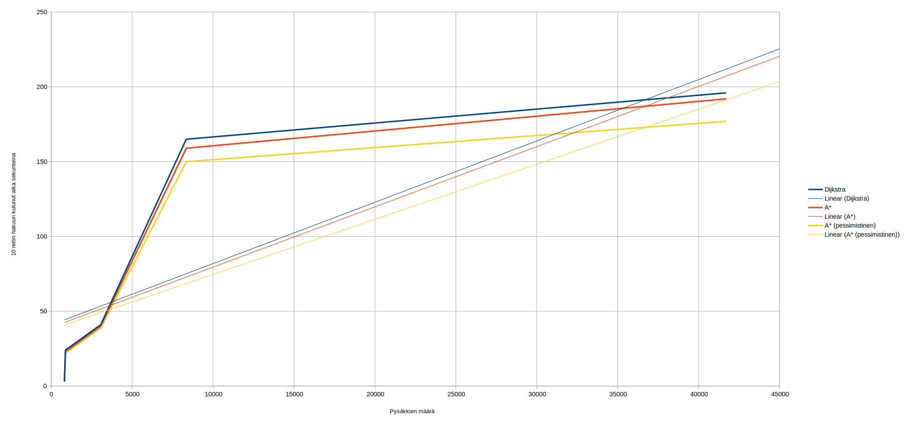

## Yksikkötestit

Ohjelma sisältää runsaasti yksikkötestejä, jotka testaavat yksittäisten luokkien ja metodien toimivan oikein.

### Yksikkötestien suoritus

```gradle test``` 

## Suorituskykytestaus

### Algoritmien vertailu

1. Suorita ohjelma komennolla `gradle run`
2. Valitse toiminto `1 - algorithm comparison`
3. Valitse toistojen määrä

Ohjelma laskee halutun määrän satunnaisia reittejä ja tulostaa ajan, jota reittien hakemiseen käytettiin tietyllä algoritimilla.
Esimerkki tulosteesta:
```
Dijkstra found 15 random routes in 327s
AStar (pessimistic, unoptimal routes) found 15 random routes in 316s
AStar found 15 random routes in 312s
```

### Algoritmien vertailu monella syötteellä

* Aja ohjelma komennolla `gradle run --args='--time-complexity-test tulokset.csv <polut GTFS syötteisiin`
  * Esim. `gradle run --args='--time-complexity-test results.csv /home/jaakko/Downloads/GTFS/berlin /home/jaakko/Downloads/GTFS/HSL /home/jaakko/Downloads/GTFS/kaunas /home/jaakko/Downloads/GTFS/lappeenranta /home/jaakko/Downloads/GTFS/tampere'`

## Testaustuloksia

Ohjelmalle on annettu syötteeksi Berliinin, HSL-alueen, Kaunasin, Lappeenrannan ja Tampereen GTFS-syötteet ja selvitetty kuinka 
kauan kullakin algoritmillä menee 10 reitin laskemiseen. 

Vertailuun on lisätty vertailun vuoksi myös A*-algoritmi, joka käyttää 
pessimististä heuristiikkafunktiota (= lasketaan, kauanko menisi aikaa, jos pysäkiltä pitäisi kävellä päätepysäkille). Tämä 
pessimistinen A*-algoritmi ei siis anna täysin optimaalista reittiä.


|                  | Pysäkit | Dijkstra | A*   | A* (pessimistinen)
|------------------|---------|----------|------|--------------------
| **Berliini**     | 41697   | 196s     | 192s | 177s
| **HSL**          | 8340    | 165s     | 159s | 150s
| **Kaunas**       | 876     | 24s      | 23s  | 22s
| **Lappeenranta** | 813     | 3s       | 3s   | 3s
| **Tampere**      | 3058    | 41s      | 40s  | 39s



Kuten kuvaajista huomataan, Dijkstran algoritmi on jokaisessa tapauksessa hitain. Ero A*-algoritmiin ei kuitenkaan ole suuri ja 
tämä johtuu enimmäkseen siitä, että joukkoliikennedatalle sopivan heuristiikkafunktion luominen on hankalaa, joten A*-algoritmi 
joutuu käymään läpi melkein yhtä paljon pysäkkejä kuin Dijkstran algoritmi.

Kuvaajasta myös huomataan, että reitin hakuun kuluva aika kasvaa, kun syötteessä on enemmän pysäkkejä. Toisaalta reitin hakuun 
kuluva aika vaihtelee paljon, eikä kasvu näytä olevan lineaarista.  
Reitin hakuun kuluvaan aikaan vaikuttaa huomattavan paljon syötteen muut ominaisuudet (esimerkiksi syötteen kattama maantieteellinen alue, onko syötteessä mukana raideliikennettä, kuinka 
tiheästi pysäkit sijaitsevat ja missä muodossa aikataulut on kuvattu syötteeseen [esim. HSL-alueella jokaisen arkipäivän lähdöt on 
merkitty erikseen, kun taas Berliinissä arkipäiville on vain yksi aikataulu]).  
